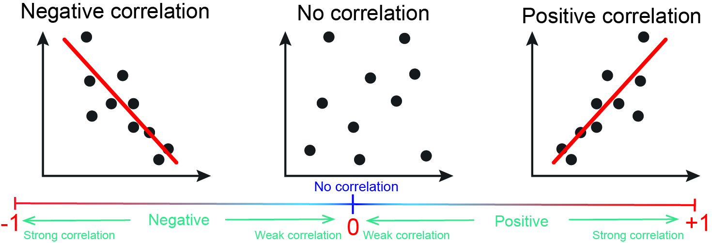
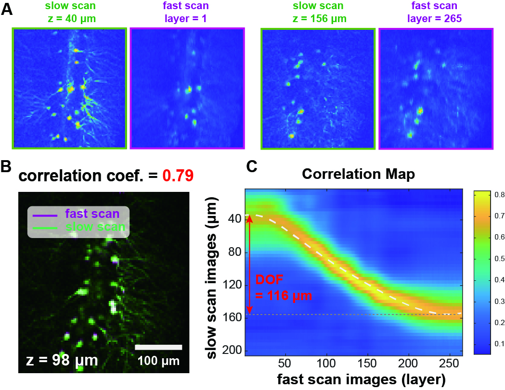

## Pearson Correlation Coefficient (PCC)

The PCC is used to assess the linear relationship between two variables. It is denoted by the symbol r and ranges from 1 to 1, which provides valuable insights into the degree of association between two sets of data.

The formula to calculate the PCC (r) between two variables of X and Y with n data points,

$$r=\frac{\Sigma^n_i(X_i-\bar{X})(Y_i-\bar{XY})} {\sqrt{\Sigma^n_i(X-\bar{X})^2} \sqrt{\Sigma^n_i(Y-\bar{Y})^2)}}$$

$$\bar{X}$$ and $$\bar{Y}$$ are the average of variables respectively.

As r = 1 indicates a perfect positive linear relationship, meaning that as one variable increases, the other variable increases proportionally. 

As r = 1 indicates a perfect negative linear relationship, meaning that as one variable increases, the other variable decreases proportionally. 

As r = 0 indicates no linear relationship b etween the variables.

We utilize the PCC for various image comparison tasks, for example, determining the DOF of the TAG lens by analyzing the correlation contour maps of low and high speed scanning images to find the best corresponding layer.

Or in image registration, PCC is used as a similarity metric to measure the alignment accuracy between two images. (As [3d motion correction](3d_motioncorrection)) 
