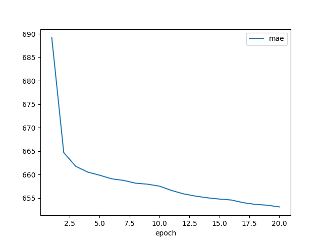
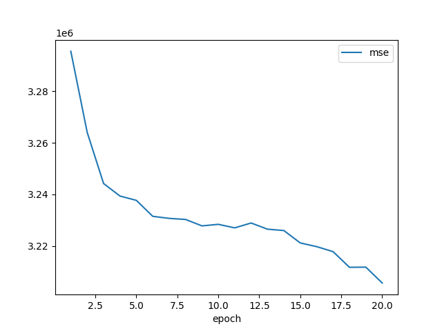

after training, the models will be saved in this folder.

if your select 'show_loss_record = True' in 'demo_train_pipeline.py', there will be three images to show the curve of loss function, MAE, MS.

For example,

Loss function:

MAE curve:

MSE curve:

From these figures, we know that after 20 epoches, the model has converge, and from MSE curve, which it has already overfitting.

You should decrease the iterations (epoches) of training.
