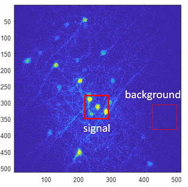
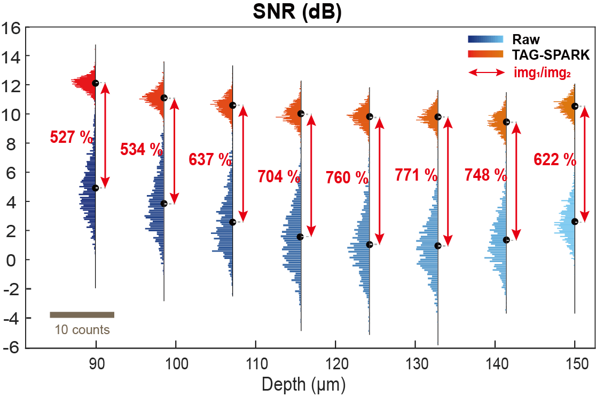
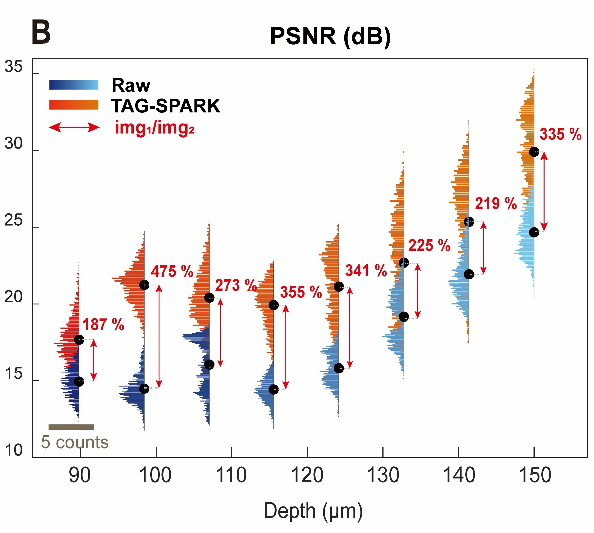
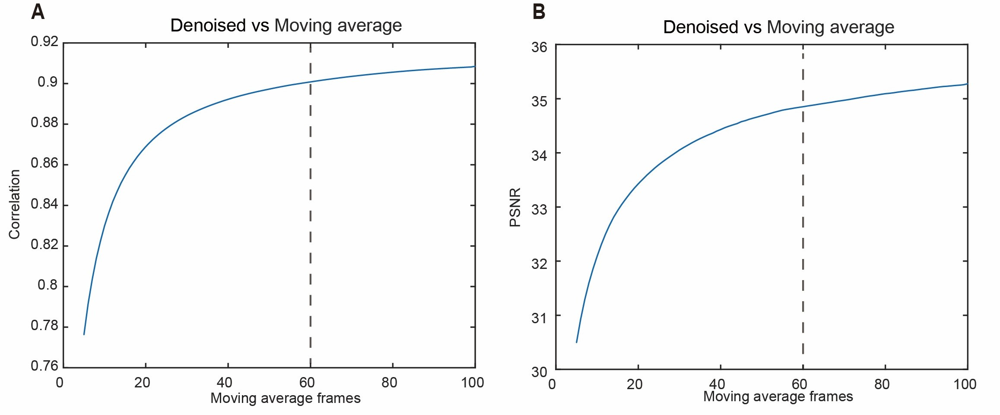

# Evaluation of image quality

SNR and PSNR are two metrics commonly used to assess the quality of images. SNR focuses on the ratio of signal to noise, while PSNR focuses on the amount of distortion in the image. They are often expre ssed in decibels (dB), which facilitates easy comparison across different imaging systems. Although both metrics evaluate the relationship between the signal and noise, they differ in their calculations and applications.

**SNR**

SNR measures the ratio of the measured signal strength to the overall measured noise intensity at each pixel. It provides a ge neral indication of how much the signal stands out from the noise, reflecting the clarity of the signal relative to the background noise level.

$$SNR=10log_10(\frac{I-bg}{\sqrt(I-bg+\sigma^2)})$$

where I is the average intensity of the signal in the image, bg represents the average intensity of the region without signal, i.e. background region. $$\sigma$$ is the standard deviation of background intensity. dB scale uses a logarithmic representation.

Notably, we select different ROI to define signal and background region and do the average calcualtion:



*reference:*

*Y. Zhao, M. Zhang, W. Zhang, Y. Zhou, L. Chen, Q. Liu, P. Wang, R. Chen, X. Duan, F. Chen, H. Deng, Y. Wei, P. Fei, Y. H. Zhang, Nat Methods 2022, 19(3), 359-369, https://doi.org/10.1038/s41592-022-01395-5.*

**Peak Signal to Noise Ratio (PSNR)**

On the other hand, PSNR is specifically used to valuate how much the quality of the signal is affected by distortion. It calculates the ratio between the maximum intensity of the image and the power of the noise affecting the image. Therefore, it needs **a noise free image as ground truth** (or to calculate the MSE , which quantifies the average squared difference **between two images**. Smaller MSE suggests less disparity between the images, indicating lower noise. Higher PSNR values correspond to lower levels of noise or distortion in the image, indicating higher image quality.

$$PSNR=10log_10(\frac{MAX^2}{MSE})$$

where MAX represents the maximun intensity of the image.

Notably that PSNR considers the max intensity of image, so the value must be larger than SNR value. PSNR value usually "overestimate" the image quality, and SNR value usually "underestimate" the image quality. Therefore, the image quality should be between these two value.




# calculate_psnr_v4.m

Moving average 的目的是為了找出, **多少張raw data進行time projection後可以達到與denoised data相互匹配的結果**

我們會利用 ```movmean``` 對影像的第四維度(time)進行操作, 並使用 ```downsample_factor ```來決定移動平均的窗口大小, 這裡我們設定 5~100

並且對這個moving average, 只保留那些能完全包含在窗口內的數據點的平均值, 端點數據不完整的部分將被丟棄, i.e. 原本有 1560個時間點, 經過```downsample_factor=100 ```的平均後, 只剩下 1460個時間點

而要用moving average 而不是average的目的是為了, **保留原本影像的動態變化**, 如此一來再和denoised data相比較時, 才不會受到神經訊號動態變化 (閃或暗) 的影像太多

```matlab
for downsample_factor = 5:100
    raw_4d_10x = movmean(raw_4d,downsample_factor,4, "Endpoints","discard"); 
...
```

我們會取, 經過轉折後開始趨於平穩的位置作為參考, 如此圖則代表: 

**denoised data 與 60x photon average後的raw data可以相互匹配**



