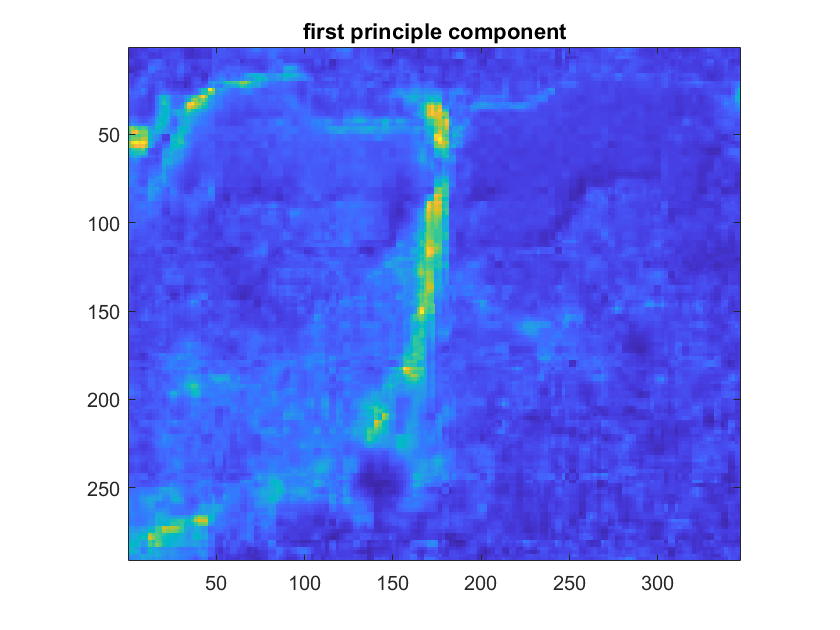
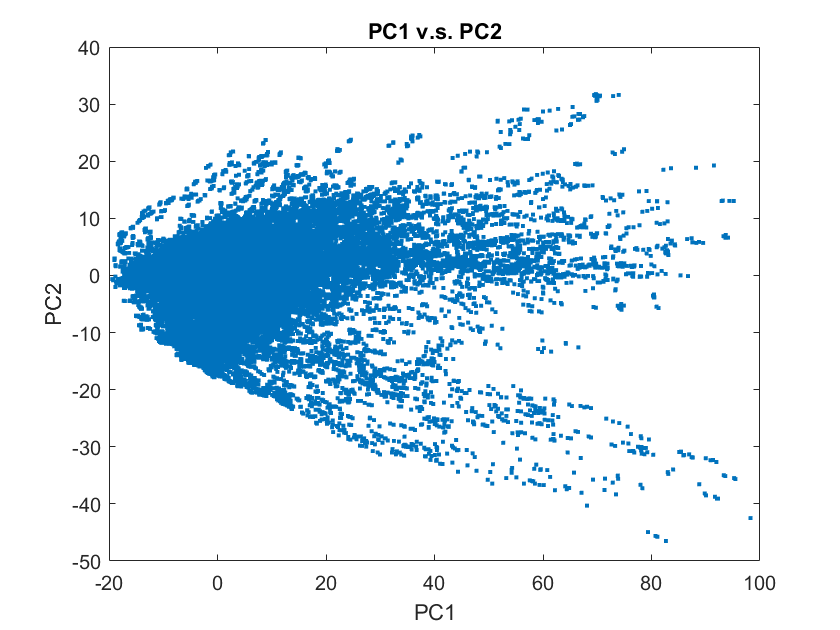

**Principle Component Analysis**

dataA為後續的主要分析的資料，此範例設定為df/f的形式(任意你想分析的資料形式)
  
`dataA(:,:,l)=delta;`

接著計算Covariance

$$Cov(X)=\frac{1}{n-1} (X-\bar{X})^T (X-\bar{X})$$

接著計算Eigenvalue & Eigenvector

`[u,value]=eig(covA);`

利用百分比(%)的形式儲存，並以遞減排列

`eigvalue=100.*diag(value)./sum(sum(value));`

`[val,num]=sort(eigvalue,'descend');`

重建回2D影像，將所有Components存於X矩陣

`P=meanA*U;`

`X=reshape(P,size(dataA,2),size(dataA,1),[]);`

我們可以由PC1-PC2的點分布圖，重新觀察這組資料帶有的隱藏訊息

我們還可以分析前幾項占比高的資料，PCA可以將訊號進行一些分類(例如:結構、背景)

