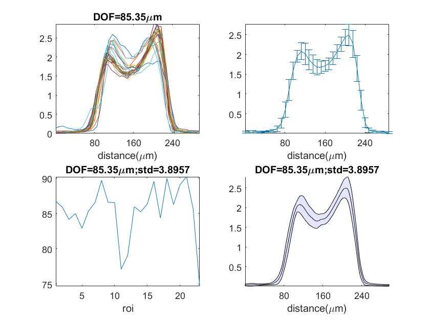

**DOF analysis**  (dof_axial_intensity.m)

You can load in example data for test.

Example data include 30 ROIs for calculation.

```matlab
load('dof40.mat')
```

We assume the result of profile with 2 peaks at the edge, so we try to find the peaks first.

```matlab
for i=1:size(dof,2)
    l=dof(:,i);
    intl=interp1(x,l,intx,'linear');  %We use interpolation to find the position corresponding to specific value
    intlbox(i,:)=intl;
    [pks,locs] = findpeaks(intl);  %We find the peak and position in z, we expect to find 2 peaks, if it can find only one or more than 2, it will show you error.
    h= sort(pks,'descend'); %Sorting the peaks follow depths
    rightmax = find(intl==h(1));
    leftmax = find(intl==h(2));
    half_max=(intl(rightmax)-min(intl))/2;  %find the FWHM value
    [~,maxnum]=min(sqrt(intl(rightmax:end).^2-half_max^2)); %在右側的最高點向右找,找到最接近FWHM的位置,也就是與FWHM相對距離最短的
    maxnum=maxnum+rightmax;  %找到的位置要再加上(向右)原本最高點的起始值
    [~,minnum]=min(sqrt(intl(1:leftmax).^2-half_max^2)); %在左側的最高點向左找,找到最接近FWHM的位置,也就是與FWHM相對距離最短的
    FWHM=abs(maxnum-minnum); %找到的位置要再減掉(向左)原本最高點的起始值
    record(i)=FWHM;
    poslist(i,:)=[maxnum,minnum];
end
```

為了避免過大誤差值,直接設定某閾值作為篩選

```matlab
err=median(record);
remove1=find((record>err+90*voxelz));
remove2=find((record<err-90*voxelz));
record([remove1,remove2])=[];
orirecord=record./100.*voxelz;
poslist([remove1,remove2],:)=[];
intlbox([remove1,remove2],:)=[];
```

以下我們以統計方式算出平均值與標準差

```matlab
error=std(normempty(:,1:100:end));
avgnorm=mean(normempty,1);
```

由以上的結果我們可以畫出以下的圖:



圖1: 畫出所有還在閾值內的line profile

圖2: 以平均值為主畫出各深度的error bar

圖3: 將各ROI平均值標出

圖4: 底色的上下邊界是由平均值與標準差決定;中間的實線即平均值的結果

